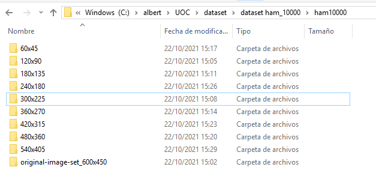

# Entrenament d’una xarxa neuronal per al diagnòstic de lesions de la pell amb el dataset HAM10000

**Albert Baranguer i Codina**\
Màster Universitari en Enginyeria Informàtica
M1.217 - TFM-Intel·ligència Artificial

**Professor ponent**: Longlong Yu\
**Professor Responsable de l'Assignatura**: Carles Ventura Royo

## Paraules clau
“Medical Images”, “Unbalanced dataset”,  “Data augmentation”

## Resum del Treball
"Hi han diverses tècniques que es poden aplicar per al diagnòstic del càncer de pell. A més  de les tècniques de cirurgia menor com la biòpsia, es poden aplicar tècniques de diagnòstic per la imatge.
El diagnòstic per la imatge és, essencialment, un problema de classificació d’imatges. És un problema escaient, doncs, per a ser resolt amb tècniques de Machine Learning /Deep Leaarning (ML/DL). La temàtica del Treball Final de Màster (TFM) és  la classificació d’imatges aplicada al diagnòstic de lesions de la pell, com poden ser els càncers de pell.  
Més que aconseguir uns resultats òptims en la classificació, l’objectiu principal ha estat desenvolupar una comprensió general de conceptes i tècniques bàsiques de  ML/DL aplicada a la classificació d’imatges mèdiques. I també el coneixement i aplicació de tècniques bàsiques de ML/DL per a la millora de les característiques (principalment mAP i F1-Score) de la xarxa classificadora.
Tenint en compte les restriccions de temps i recursos disponible, per a la classificació s’ha utilitzat una xarxa neuronal petita de tipus ResNet18 que ha estat entrenada amb el dataset HAM10000 mitjançant tècniques d’Aprenentatge Automàtic Supervisat, utilitzant scripts desenvolupats amb Python i el framework PyTorch, sobre diferents entorns de treball. S’ha seguit una metodologia iterativa i incremental. 
Aquesta memòria recull els resultats obtinguts, així com breus introduccions als  diferents aspectes teòrics i pràctics que s’han tractat."

## Millores
Com l'objectiu del TFM ha estat l'estudi de les tècniques mñ´´es que no l'obtenció d'un producte, el que he obingut han estat molts scripts de proves.

El que caldria ara és reorganitzar-los.

- La intenció és refinar el codi: Fer un refactoring seguint els principis del Clean Code de Martin Fowler. Que el codi sigui legible, autoexplicatiu i mantenible. 
- A més del refactoring seria molt recomanable fer una GUI que permetés llençar els experiments i configurar-ne els paràmetres.
- També seria molt útil un script instal·lador
- pendent: els out-of-memory. Es poden evitar? En cas que no es pugui evitar que un entrenament peti, és podria fer que es reprengués automàticament des de l'última epoch acabada correctament.

## Instal·lació
Per a poder executar localment els experiments i els scripts cal:
1. Descarregar el codi del GitHub
2. Instal·lar el dataset i crear-ne les variants redimensionades que calguin 
3. Crear la carpeta de logs de Tensorboard (imprescindible per a poder generar les gràfiques).
4. ajustar la configuració de l'experiment que es vulgui executar per a que tingui en compte les carpetes de dataset i de tensorboard.

### Dataset Ham10000
Per a que funcionin els scripts cal una estructura de directoris determinada en la que emmagatzemar el dataset i les variants redimensionades que calguin.
Aquesta estructura és parametritzable als scripts ham10000_autoconfig.py de cada experiment (_TODO_: fer un script de configuració únic per a tots els experiments).

Per exemple, a la màquina windows que he fet servir he creat la carpeta C:\albert\UOC\dataset\dataset ham_10000\ham10000

Al final només he fet servir les imatges de 300x225 però, priori, no sabia quines mides acabaria utilitzant; per això, dins d'aquesta carpeta vaig crear les següents subcarpetes, i hi vaig posar les imatges redimensionades corresponents.

| Carpeta | Descripció |
|---|---|
| 60x45 | Imatge de Ham10000 redimensionades a 60x45px. Les imatges tenen el mateix nom que les originals del dataset |
| 120x90 | Imatge de Ham10000 redimensionades a 120x90px. Les imatges tenen el mateix nom que les originals del dataset |
| 180x135 | Imatge de Ham10000 redimensionades a 180x135px. Les imatges tenen el mateix nom que les originals del dataset |
| 240x180 | Imatge de Ham10000 redimensionades a 240x180px. Les imatges tenen el mateix nom que les originals del dataset |
| 300x225 | Imatge de Ham10000 redimensionades a 300x225px. Les imatges tenen el mateix nom que les originals del dataset |
| 360x270 | Imatge de Ham10000 redimensionades a 360x270px. Les imatges tenen el mateix nom que les originals del dataset |
| 420x315 | Imatge de Ham10000 redimensionades a 420x315px. Les imatges tenen el mateix nom que les originals del dataset |
| 480x360 | Imatge de Ham10000 redimensionades a 480x360px. Les imatges tenen el mateix nom que les originals del dataset |
| 540x405 | Imatge de Ham10000 redimensionades a 540x405px. Les imatges tenen el mateix nom que les originals del dataset |
| original-image-set_600x450 | Les imatges de Ham10000 amb la mida original |



### Com executar els scripts
Per una qüestió pràctica gairebé sempre els he executat des del PyCharm, però no ha d'haver cap problema en executar-los des d'una línia de comandes

No cal fer més que:
```
python nom_de_l'script
```

Descripció dels scripts i carpetes dels experiments i carpetes utilitzades

| Directori | Descripció |
|---|---|
|/base | classes i scripts que fan servir tots els experiments |
|/demos | calaix de sastre amb scripts variats de proves, codi descarregat... |
|/exp1 | classses i scripts utilitzats només per l'experiment 1 |
|/exp2 | classses i scripts utilitzats només per l'experiment 2 |
|/exp3 | classses i scripts utilitzats només per l'experiment 3 |
|/exp4 | classses i scripts utilitzats només per l'experiment 4 |
|/exp5 | classses i scripts utilitzats només per l'experiment 5 |
|/exp6 | classses i scripts utilitzats només per l'experiment 6 |
|/exp7 | classses i scripts utilitzats només per l'experiment 7 |
|/exp8 | classses i scripts utilitzats només per l'experiment 8 |
|/exp9 | classses i scripts utilitzats només per l'experiment 9 |
|/mean_and__std_dev | scripts i classe auxiliar per al càlcul de la mitjana i desviació estàsndard dels canals RGB de les imatges de HAM10000 |
|/precision_recall_curve_plotter |aquí volia fer un script de càlcul - dibuix de la corba de precision recall, com abase per a calcular la mAP |
|/resizer | l'script de redimensionat d'imatges|

### Correspondència entre els experiments descrits a la memòria i els scripts al github
|Experiment TFM|Script|
|---|---|
|Experiment 1 del TFM | ham10000_exp_01_baseline.py|
|Experiment 2 del TFM. Overfitting | ham10000_exp_07_baseline_overfitting.py|
|Experiment 3 del TFM. Congelació de capes | ham10000_exp_09_baseline_layers_1_and_2.py|
|Experiment 4 del TFM | ham10000_exp_02_baseline_weighted.py|
|Experiment 5 del TFM | ham10000_exp_03_baseline_weighted_normalized.py|
|Experiment 6.1 del TFM | ham10000_exp_04_set1_baseline_albumentations.py|
|Experiment 6.2 del TFM | ham10000_exp_04_set2_baseline_albumentations.py|
|Experiment 6.3 del TFM | ham10000_exp_04_set3_baseline_albumentations.py|
|Experiment 6.4 del TFM | ham10000_exp_04_set4_baseline_albumentations.py|
|Experiment 6.5 del TFM | ham10000_exp_04_set5_baseline_albumentations.py|
|Experiment 6.6 del TFM | ham10000_exp_04_set6_baseline_albumentations.py|
|Experiment 7.1 del TFM | ham10000_exp_05_set6_baseline_centercrop_albumentations_tta_epochs5_full.py (amb mateixos pesos que als experiments anteriors)|
|Experiment 7.2 del TFM | ham10000_exp_05_set6_baseline_centercrop_albumentations_tta_epochs5_full.py (amb pesos modificats)|
|Experiment 7.3 del TFM | ham10000_exp_05_set6_baseline_centercrop_albumentations_tta_epochs6.py|
| no el vaig executar | ham10000_exp_05_set6_baseline_centercrop_albumentations_tta_epochs7.py|
|Experiment 7.4 del TFM | ham10000_exp_05_set6_baseline_centercrop_albumentations_tta_epochs8.py|
|Experiment 7.5 del TFM | ham10000_exp_05_set6_baseline_centercrop_albumentations_tta_epochs9.py|
|Entrenament per parts (Experiment 8 del TFM) | ham10000_exp_08_baseline_pretrained.py|
|Experiment 9 del TFM | ham10000_exp_06_set6_baseline_centercrop_albumentations_tta_epochs30_dropout2d.py|
|Proves Experiment 9 del TFM | ham10000_exp_06_set6_baseline_centercrop_albumentations_tta_epochs12_dropout2d_pretrained.py|
|Proves Experiment 9 del TFM | ham10000_exp_06_set6_baseline_centercrop_albumentations_tta_epochs5_dropout2d.py|
|Proves Experiment 9 del TFM | ham10000_exp_06_set6_baseline_centercrop_albumentations_tta_epochs6_dropout2d.py|

